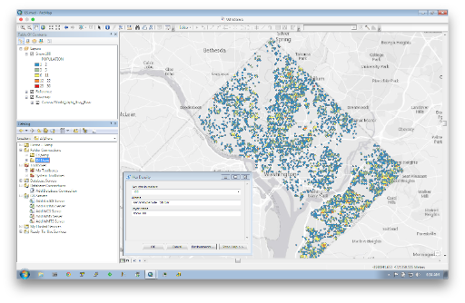
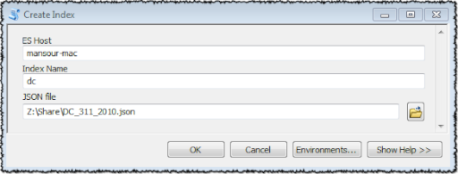
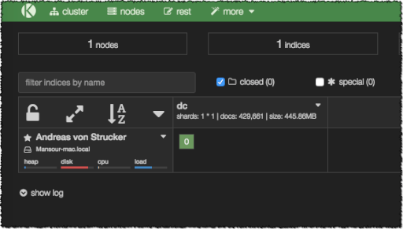
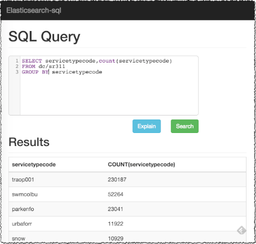
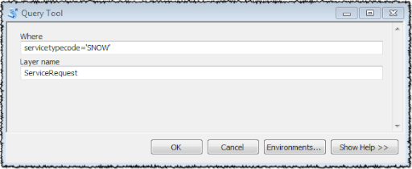
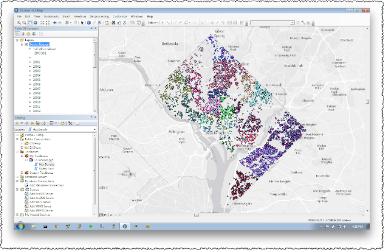
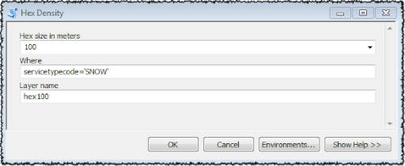
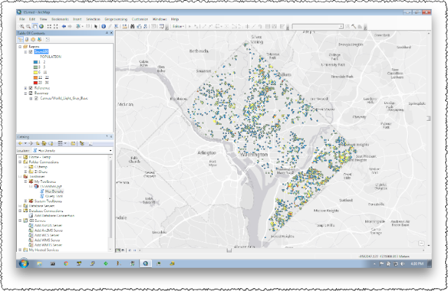

# Spark CSV ES

This project is divided into 2 sub-projects:

1. A bulk loader of one or more CSV files with spatial and temporal content into Elasticsearch.
2. An Arcpy Toolbox to query and view the bulk loaded documents.



## CSV Bulk Loader

This sub project is a [Spark](http://spark.apache.org/) based job to bulk load spatial and temporal point data from one or more CSV files into [Elasticsearch](https://www.elastic.co/guide/en/elasticsearch/hadoop/master/spark.html)

The loader expands the date fields into individual year, month, day, hour and day of week fields.
And the spatial lat/lon fields are converted to [geo_point](https://www.elastic.co/guide/en/elasticsearch/reference/1.6/mapping-geo-point-type.html) fields.
In addition, the lat/lon fields are expanded to x/y [web mercator](https://en.wikipedia.org/wiki/Web_Mercator) fields and into one or more [hexagonal row/columns](http://thunderheadxpler.blogspot.com/2015/01/scala-hexagon-tessalation.html) indexes at different sizes.

The intent of these expansions is to take advantage of the [Elasticsearch aggregation framework](https://www.elastic.co/guide/en/elasticsearch/reference/current/search-aggregations.html)
to query and map the _density_ of the imported documents for better insight.  
In time, documents can be aggregated by year, month, day, hour and day of week properties.
In space, documents can be aggregated by their hexagonal index properties.

The job is configured using a command line parameter file in [properties](http://docs.oracle.com/javase/7/docs/api/java/util/Properties.html) format.

The following is a sample with the necessary keys:

```ini
#
# Spark master - http://spark.apache.org/docs/latest/submitting-applications.html#master-urls
#
spark.master=local[*]
#
# Elasticsearch hosts
#
es.nodes=localhost
#
# Optional field to be used as the document identifier
#
es.mapping.id=object_id
#
# The index and mapping names
#
index.mapping=myindex/mymapping
#
# The CSV input path
#
input.path=/a/path/to/points.csv
#
# Number of header lines to skip
#
header.count=0
#
# Throw an exception on parsing error
#
error.exception=true
#
# Field separator - default is tab
#
field.sep=,
#
# The hexagon indexes to generate for each geo type field.
#
# format: label1,size1[;label2,size2] ...
#
hex.sizes=\
  50,50.0;\
  100,100.0;\
  1K,1000.0
#
# The fields to import, and how to interpret each field.
#
# format: type,property,csv_index[,additional type configuration]
#
# Note: csv_index is zero based !
#
# types:
#
# oid - optional document identifier field
# geo - the last two parameters indicate the lon and lat field indexes in the csv file.
# date - the last parameter indicates how to parse the csv date field.
#
fields=\
  oid,object_id,0;\
  geo,loc,1,2;\
  date,a_date,3,YYYY-MM-dd;\
  string,a_string,4;\
  int,a_int,4;\
  float,a_float,5
```

The fields of type `date` will be expanded to additional properties of type `integer` named in the following convention:

* property_yy - the date year
* property_mm - the date month
* property_dd - the date day
* property_hh - the date hour
* property_dow - the date day of week

The `date` fields are parsed using [joda](http://joda-time.sourceforge.net/apidocs/org/joda/time/format/DateTimeFormat.html) 

The fields of type `geo` will be expanded to additional properties of type `integer` named in the following convention:

* property_x - the location x web mercator meter
* property_y - the location y web mercator meter
* property_hexlabel - the location hexagonal index

For the above sample, the following properties will be created; `loc_x`, `loc_y`, `loc_50`, `loc_100`, `loc_1K`

### Building the Project

Make sure to first clone and install the following projects:

* [Web Mercator](https://github.com/mraad/WebMercator)
* [Hex Grid](https://github.com/mraad/hex-grid)
* ~~[Elasticsearch Hadoop](https://github.com/elastic/elasticsearch-hadoop)~~
* ~~[Univocity Parsers](https://github.com/uniVocity/univocity-parsers)~~

```shell
$ mvn install
```

This will create the Spark Job `spark-csv-es-2.3.1.jar` in the `target` folder.

## Walk Through Example

The following is a simple example on how to bulk load [The District Of Columbia 311 Service Requests](http://data.octo.dc.gov/NewCalendar.aspx?datasetid=4#formats).
I downloaded the data in CSV format from 01/01/2010 to 12/31/2010.
This is not a big dataset (about 430,000 records), but it is nice one to start with as each record has a couple of dates, times, a latitude and a longitude value.
The file is henceforth named `DC_311_2010.csv`.

## Install Elasticsearch

Download and install [Elasticseach](https://www.elastic.co/downloads/elasticsearch)

**Note:** Before starting the server, make sure to:

1. Define the env variable `ES_HEAP_SIZE` to set both the minimum and maximum memory to allocate.
2. Adjust the property `network.host` in the `config/elasticsearch.yml`. This will be henceforth known as `${ES_HOST}`.

## Install kopf Plugin

Kopf is a [web admin interface for elasticsearch](https://github.com/lmenezes/elasticsearch-kopf)

```shell
$ bin/plugin --install lmenezes/elasticsearch-kopf/master
$ open http://${ES_HOST}:9200/_plugin/kopf
```

## Install SQL Plugin

This [plugin](https://github.com/NLPchina/elasticsearch-sql) enables the query of Elasticsearch indexes using SQL.

```shell
$ bin/plugin -u https://github.com/NLPchina/elasticsearch-sql/releases/download/1.3.4/elasticsearch-sql-1.3.4.zip --install sql
$ open http://${ES_HOST}:9200/_plugin/sql
```

**Note:** Had to restart the server for this plugin to work - not sure why !

## Generate Properties File

Since the downloaded CSV file has a header to describe the values in each record,
we will use the header values to generate an initial `.properties` file using the `gen-properties.py` script.

```shell
$ gen-properties.py DC_311_2010.csv
```

The script reads the first line of the `DC_311_2010.csv` file and generates a sibling file
named `DC_311_2010.properties`, where all the document properties are assumed to be of type `string`.

## Adjust Properties Types

Scanning a sample of the input data, we can recognize date formatted values, integers, floats and geo fields.

Check out the adjustments in the file `data/DC_311_2010.properties`.

**Note to myself:** One of these days, have to integrate a 'smart' value recognizer, rather than doing this by hand.
After all, that is what computers are for :-)

## Generate Elasticsearch Index/Mapping File

A [mapping](https://www.elastic.co/guide/en/elasticsearch/reference/current/mapping.html) file can be generated from
the `.properties` file using the `gen-mapping.py` script. 

Make sure to first install the [pyjavaproperties](https://pypi.python.org/pypi/pyjavaproperties) python module.
 
```shell
$ pip install pyjavaproperties
```

```shell
$ gen-mapping.py DC_311_2010.properties 
```

**Note** You might want to modify the `number_of_shards` and `number_of_replicas` as they are set for a development
environment with values of `1` and `0`.
 
## Creating the Index and Mapping

```shell
$ curl -XDELETE "${ES_HOST}:9200/dc";curl -XPOST "${ES_HOST}:9200/dc" -d @DC_311_2010.json
```

In the `ESToolbox.pyt` toolbox exists the `CreateIndexTool` tool to create an ES index.
   
Make sure to first install the [elasticsearch-py](https://www.elastic.co/guide/en/elasticsearch/client/python-api/current/index.html) python module.
   
```shell
$ pip install elasticsearch
```
,   


## Bulk Load CSV using Spark

Download and install [Apache Spark](http://spark.apache.org/downloads.html) and make sure the Spark `bin` path
is appended to the value of your `PATH` environment variable. 

Bulk load the CSV by submitting the following spark job:

```shell
$ spark-submit spark-csv-es-2.3.1.jar DC_311_2010.properties
```

The data shards and replications can be seen in the kopf web dashboard:



The data can be queried using the SQL plugin:



## Sample queries

```sql
SELECT loc, loc_x, loc_y FROM dc/sr311 limit 32
```

Query the geo locations and associated web mercator values for the first 32 documents.

```sql
SELECT servicecodedescription,count(servicecodedescription) FROM dc/sr311 where serviceduedate_dow=1 group by servicecodedescription
```

Count by `service code description` the servive requests that are due on a Monday (dow=1)

```sql
SELECT loc_100,count(loc_100) FROM dc/sr311 where serviceduedate_dow=1 and loc_100 <> '0:0' group by loc_100
```

Find the population density of service requests that have a due date on a Monday at a 100 meter resolution.
The `loc_100` value is a composite of the row and column of a 100 meter hexagon centroid.
The following section will describe how to convert the centroid row column values into a polygon feature to be displayed on a map.

## Visualizing the Documents

To view the documents, we will query Elasticsearch using an [ArcPy](https://desktop.arcgis.com/en/desktop/latest/analyze/arcpy/a-quick-tour-of-arcpy.htm) tool.
The tool submits SQL queries to the SQL plugin rest endpoint (http://${ES_HOST}:9200/_sql) and the resulting documents are converted to features in an in-memory [feature set](http://desktop.arcgis.com/en/desktop/latest/analyze/arcpy-classes/featureset.htm).
The feature set is defined as an output [parameter](http://desktop.arcgis.com/en/desktop/latest/analyze/creating-tools/setting-script-tool-parameters.htm) to the tool and will be
implicitly added to the map as a layer.

There are 2 tools in the `ESToolbox.pyt` tool box:


### Query Tool

This tool enables the user to define a `where` clause to filter the service requests on the server side and
converts the resulting hits into point features.



**Note:** there is a hard limit of 100,000 resulting documents in the default implementation.



### Hex Density

This tool enables the user to define a `where` clause to filter the service requests on the server side and a hexagonal clustering size.
The resulting hits are converted to features with hexagon shaped polygons for geometry and the number of service requests that fall into its area
as attribute.





There is **no** spatial point in polygon operation in the above query. This is a pure `group by` SQL operation,
because all the services requests have be preprocessed at load time with the hexagonal indexes that they will fall into.
And these indexes have been added as searchable properties into the document enabling fast aggregation based on a user specified index.

What is actually returned by Elasticsearch is the hexagon _index_ in the form of a row and column.
The conversion from row/column to an array of coordinates that make up the polygon shape is done on the client side at runtime.
Retuning indexes massively reduces the network payload and makes the server do less work because the polygon coordinates generation is offloaded to the client. 
This is _cooperative processing_ between the client and the server, a term I used to use 20 years ago on [SDE](http://www.esri.com/software/arcgis/arcsde) when I was a specialist on it !

#### TODO

* Convert configuration file to JSON format
* Convert the bulk loader to a Tool in a Toolbox.
